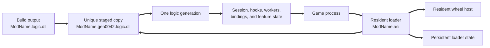
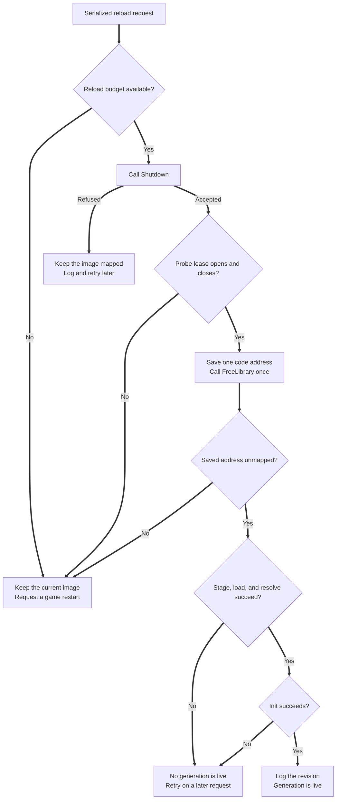

# Hot-reload development guide

Split a mod into a thin loader and a logic DLL to change mod code without a game restart. The loader lives for the process. The logic DLL is replaced on demand.

| Binary              | Role                                        | Lifetime         |
|---------------------|---------------------------------------------|------------------|
| `ModName.asi`       | Stages, loads, and replaces the logic DLL   | The game session |
| `ModName.logic.dll` | Hooks, features, config, and input bindings | One generation   |

This guide defines DetourModKit unload guarantees, module pin sources, and the staged-generation pattern for repeatable reloads.

CI compiles the [reference pair](../../../examples/staged_reload/) to check current API use. It does not run the pair. [The examples contract](../../../examples/README.md) defines ownership and compatibility.

## Why split the mod

A normal DLL development cycle discards the current game session after each code change. The restart also discards the exact game state that exposed a defect. A resident loader removes both costs from most logic changes.

The split creates one stable control plane and a sequence of logic generations. The loader owns reload requests, staged files, persistent state, and the unload verdict. In the reference topology, each generation owns its `Session`, hooks, workers, subscriptions, callbacks, and feature state.



The loader maps a unique copy, so the linker can replace the next build output while the game runs.

## Start with the reference pair

Study the checked-in example before adaptation to a mod project.

| File | Use |
| --- | --- |
| [`mod_loader.cpp`](../../../examples/staged_reload/mod_loader.cpp) | Own the control thread, wheel host, stage copies, lease probe, unload probe, and restart verdict. |
| [`mod_logic.cpp`](../../../examples/staged_reload/mod_logic.cpp) | Own one `Session`, `HookStack`, worker set, input scope, and typed `Shutdown()` result. |
| [`protocol.h`](../../../examples/staged_reload/protocol.h) | Carry a fixed-width request, ABI revision, generation id, and wheel-host table pointer across the DLL boundary. |
| [`examples/CMakeLists.txt`](../../../examples/CMakeLists.txt) | Keep the loader on `DetourModKit::WheelHost` and the logic DLL on the full archive. |

Build the pair with either Debug preset:

```bash
cmake --preset mingw-debug
cmake --build build/mingw-debug --target dmk_example_staged_loader dmk_example_staged_logic --parallel

cmake --preset msvc-debug
cmake --build build/msvc-debug --target dmk_example_staged_loader dmk_example_staged_logic --parallel
```

Run the MSVC commands from an x64 Developer Command Prompt.

Set `DMK_EXAMPLE_MOD_NAME` in [`examples/CMakeLists.txt`](../../../examples/CMakeLists.txt). If an ASI host loads the pair, rename the loader DLL to `<name>.asi`. Put `<name>.logic.dll` beside it.

The fixed-width C protocol permits different loader and logic-DLL toolchains. Verify the deployed mixed pair with a lifecycle host before use.

## Choose the ownership topology

The ownership choice controls which image receives DetourModKit module references.

| Concern | DetourModKit in the logic DLL | DetourModKit in a persistent host |
| --- | --- | --- |
| Recommended use | Normal mod development | A host that must unmap every accepted generation |
| Development and release code | Identical mod ownership | Different ownership between development and release |
| DetourModKit objects | Owned by each logic generation | Owned by the resident host |
| Logic DLL contents | Full archive plus mod code | Mod callables and generation state, but no DetourModKit objects |
| Reload cost | Full `Session` teardown and restart | Host services remain live |
| Unmap limit | A permanent logic-side pin retains the image | A retained host object refuses the unmap |
| Boundary | Stable C exports; a table is optional | A versioned C table is required |

Use the logic-DLL topology unless a measured retained-image cost requires the persistent host. Read [Topology: DetourModKit in the logic DLL](#topology-detourmodkit-in-the-logic-dll) for its contract. Read [Advanced topology: DetourModKit in a persistent host](#advanced-topology-detourmodkit-in-a-persistent-host) for the alternative.

## What pins the module that hosts DetourModKit

Some subsystems take counted module references on the module that links the archive. `FreeLibrary` cannot unmap a pinned module. A later `LoadLibrary` on the same path silently returns the stale image instead of the new build.

| Source | `ModulePinReason` | Reference taken | Released |
| --- | --- | --- | --- |
| A live inline, mid, or VMT hook | `Hook` | Before hook publication | After proved teardown. A failed proof retains the reference. |
| A `StoppableWorker` | `Worker` | Before thread start | After join. A detach or failed join retains the reference. |
| The bootstrap worker | `Bootstrap` | Before thread start | Immediately before its terminal `FreeLibraryAndExitThread`. |
| The async logger writer | `AsyncLogger` | Before thread start | After join. A detach retains the reference. |
| The memory-cache cleanup thread | `MemoryCache` | Before thread start | After join. A detach retains the reference. |
| The input poll thread | `InputPoller` | Before thread start | After join. A loader-lock detach retains the reference. |
| The lifecycle reaper | `LifecycleReaper` | Before thread start | Never. The process-lifetime thread owns this permanent reference. |
| A wheel binding (local `MessageHook`) | `MessageHookKeepalive` | First successful hook publication | Never. Hook removal is cleanup only, because a selected callback can run after `UnhookWindowsHookEx`. |
| XInput interception self-reference | `XInputKeepalive` | Before hook creation | On install rollback or proved clean uninstall. Retention keeps it permanently. |
| XInput provider reference | `XInputTarget` | Before hook creation | With `XInputKeepalive`. It pins the provider module, not the DMK host module. |

The permanent wheel reference enters the intentional-leak tally after successful publication, not at teardown. A teardown delta therefore reads zero for a current wheel keepalive. Read open references through `diagnostics::module_pin_count(reason)`, which stays readable after `~Session`.

`MessageHookKeepalive` and a retained XInput set are inert after teardown. A retained XInput set has one `XInputKeepalive` plus one or two `XInputTarget` references. Every other nonzero reason can identify live code.

XInput retention also logs each witness and target address. The next staged generation's first sink open erases those lines under the default `LogOpenMode::Truncate`. Set `ModInfo::log_open_mode = LogOpenMode::Append` to keep them across generations. If the loader needs a separate copy, record the lines in loader-owned storage.

The resident wheel host removes the wheel pin from the logic image. Set `input::Input::Settings::wheel_backend` to `input::Input::WheelBackend::ExternalHost`. The loader then owns that keepalive. A successful lease close is necessary but does not authorize unload. Require the typed drain, complete pin verdict, loader lease probe, `FreeLibrary`, and address-unmap probe.

The checked-in [`staged_reload` pair](../../../examples/staged_reload/) shows the loader-side probe and unmap order. The [input design note](../../design/input.md) owns the backend contract.

## Reload sequence (staged generations)

Keep DetourModKit linked in the logic DLL, exactly as in the release build. Only the loader is development-specific:

1. Serialize reload requests. The reference loader uses one control thread.
2. Call the logic DLL's `Shutdown()` export. If it returns zero, keep the DLL mapped, log the refusal, and stop.
3. Open and close a loader probe lease. If either call fails, keep the DLL mapped and request a restart.
4. Save one logic code address, then call `FreeLibrary` exactly once. If it fails, request a game restart.
5. Require the saved address to become unmapped before the next load. If it stays mapped, request a game restart.
6. Copy the rebuilt DLL to a unique staged name. Call `LoadLibrary` on the copy.
7. Resolve `Init`, `Shutdown`, and `Revision` with `GetProcAddress`. Pass the resident table to `Init`.
8. Log the exported build revision. `__DATE__` alone moves only when its translation unit recompiles.



Never load two generations by the same file name. If the loader maps the build output, the path stays locked and a rebuild cannot replace it. A unique staged name gives every generation a fresh image. It prevents stale-image reuse and replay of function-local `static` state.

### Define a retained-generation policy

A retained image keeps its code mapped, but it can still contain live old behavior. Only documented `MessageHookKeepalive` and XInput retention become inert after teardown. The reference loader requests a restart when an accepted image stays mapped. Every retained image counts against the reload budget.

A custom staged-name loader can continue after an inert retention verdict. It must refuse every other pin and enforce count and byte budgets. `ExternalHost` removes the wheel pin, but every other unload proof still applies.

Do not fight the pins:

- Do not call `FreeLibrary` repeatedly to defeat the reference count.
- Do not force an unmap. The reference protects a live frame and a selected hook callback after `UnhookWindowsHookEx` returns.
- Do not treat every `LeakSubsystem::Input` leak as harmless.
- That subsystem also records abandoned pollers and other state that can still execute.
- In a permissive loader, accept only `MessageHookKeepalive` and a retained `XInputKeepalive` / `XInputTarget` pair.
- Refuse the reload for every other nonzero reason, any drain refusal, any unjoined worker, and any unknown reason.

Budget retained generations by both count and total image bytes.

## Build, reload, and inspect

Use one repeatable development loop:

1. Change logic-DLL code.
2. Build the stable `<name>.logic.dll` output.
3. Trigger the resident loader from the game foreground window.
4. Read the loader log for the generation id, build revision, and unload verdict.
5. If the loader requests a restart, stop the reload cycle.

The reference loader removes unlocked staged copies from earlier sessions. Windows keeps a mapped stage file locked, so a retained image leaves its file in place. Do not delete or overwrite that file while its image remains mapped.

Export a revision that identifies the exact build. A source-control revision or generated build id is stronger than `__DATE__` and `__TIME__`. Log the value after `Init()` succeeds, so a stale value exposes a stale image or an unchanged revision translation unit.

Keep debugger symbols from the same build as each staged DLL. A debugger can cache symbols from the prior generation. Reload the module symbols after each accepted generation if source lines or breakpoints still name old code.

## What DetourModKit guarantees across an unload

### Hook removal needs a quiescent target

A `Hook` destruction restores the original prologue but does not freeze threads. During the rewrite, the backend removes execute permission and tracks the patch windows. Its vectored handler retries closed-window faults and relocates instruction pointers inside a tracked window. It does not drain detour bodies or code outside those windows. Removal is safe only when the hooked function is quiescent.

A fixed sleep cannot prove quiescence. `Shutdown()` must return false while any consumer-owned worker, subscription, hook caller, or other callback source can still run. The loader must keep the DLL mapped and retry later.

### Layered hooks unwind newest-first

When several handles target the same address, destroy them newest-first. `hook::HookStack` owns the handles and drains them newest-first in its destructor, its move-assignment, and `clear()`. Prefer it to a bare `std::vector<Hook>`, which carries no such order. Out-of-order teardown is contained and does not corrupt state: the older backend is retained instead of restored over the newer layer. The retention is permanent, so only newest-first returns the pristine prologue.

### Session teardown owns the process-wide subsystems

`~Session` first clears its input scope. It then stops the config watcher, input, memory cache, config registry, and logger. The process-default logger storage has process lifetime, so CRT static destructors never touch it. Teardown flushes and closes its sink. The default `LogOpenMode::Truncate` starts a clean log on the first sink open. `LogOpenMode::Append` preserves prior generation records.

Destroy the `Session` before `FreeLibrary`. If code skips this step, the old sink and async writer can outlive the image.

### State ownership across reloads

This table follows the reference topology.

| State | Owner | Result after a clean unmap | Required action |
| --- | --- | --- | --- |
| Logic globals and function-local statics | Logic generation | Reset | Recreate them in `Init()`. |
| `Session`, hooks, workers, and bindings | Logic generation | Destroyed | Drain them in `Shutdown()`. |
| Profiler ring samples | Logic generation | Lost | Export required samples before `Shutdown()`. |
| Direct game-memory writes | Game process | Preserved | Track and revert raw patches before the unload drain. |
| INI file | File system | Preserved | Load it again from the new generation. |
| Cross-generation feature state | Resident loader | Preserved | Pass fixed-width data through the versioned C request. |

Do not pass C++ containers, pointers with ownership, exceptions, or standard-library objects across a mixed-toolchain boundary. Keep every pointer in the request valid for its documented lifetime.

### Threads, TLS, and static constructors

Join every consumer-owned thread in `Shutdown()`, before the `Session` teardown. A thread that outlives `FreeLibrary` executes unmapped code.

Use [`dmk::StoppableWorker`](../../../include/DetourModKit/detail/worker.hpp). Normal destruction requests a stop and joins the thread. When the loader lock forbids a teardown that can block, it detaches and runs no stop callbacks. It leaves its counted module reference open, so the code pages stay mapped. That branch requests no stop at all, so an abandoned body never observes `stop_requested()`. Publish your own cancellation flag beside the stop token when the body must terminate on that path.

`FreeLibrary` sends no `DLL_THREAD_DETACH` notice to process threads that already exist. Do not keep logic-DLL `thread_local` state past `Shutdown()`. Provide explicit per-thread cleanup before unload. Prefer explicit `Init` and `Shutdown` functions to file-scope static constructors.

## Topology: DetourModKit in the logic DLL

This is the recommended topology, combined with the staged-generation loader above. Development and production run identical mod code, and each cycle exercises the production teardown.

Apply this `Shutdown()` order:

1. Stop and join every consumer worker.
2. Drop every dispatcher subscription.
3. Quiesce every remaining hook caller.
4. Revert every direct game-memory patch.
5. Call `prepare_logic_dll_unload*` and require `SafeToUnload`.
6. Clear the `HookStack` newest-first and latch any restore failure.
7. Destroy the `Session`.
8. Read every module-pin reason and compute the unload verdict.

Read pin counters after `~Session`, because XInput retention occurs there. The counters remain readable after the `Session` is gone.

Latch the first hook restore failure across retries. Keep every saved original pointer and target-module reference after a failure. A retained inline route can still enter the detour.

With the local wheel backend, accept only the documented inert pin and leak set. With `ExternalHost`, require zero logic-image pins and intentional leaks. Refuse every other nonzero reason.

## Advanced topology: DetourModKit in a persistent host

Use this topology only when retained generations exceed the budget. It does not exercise the single-DLL release teardown.

The host links the archive and owns every DetourModKit object. The logic DLL links no DetourModKit archive. It reaches the host through a versioned C table. Enforce that split with a logic-target link gate, based on `tests/lifecycle/CMakeLists.txt`. A second archive instance has a separate ledger and pins the logic DLL again.

| Resource | Required owner | Reason |
| --- | --- | --- |
| Config storage | Host | A bound reference into logic-DLL memory dangles after unmap. |
| `input::Input::start()` | Host | The poll-thread module reference must land on the host. |
| Hooks with logic-DLL detours | Host, with newest-first teardown | A retained hook can reach a logic-DLL detour. |

`prepare_logic_dll_unload(binding_names)` retires named input bindings and closes callback admission. It requests watcher and reload-servicer stop, then waits to one end-to-end deadline.

`SafeToUnload` means no selected input callable, config setter, user reload callback, or DetourModKit worker callable remains. Every other status refuses `FreeLibrary`. Keep the DLL mapped and retry from an off-loader-lock control thread. A timeout leaves input admission closed. Only session finalization reopens it.

`prepare_logic_dll_unload_all()` clears every input binding but keeps the poll thread alive. Use it only when the DLL that unloads owns the whole process-wide input and config surface. The registry is process-scoped, so the all-bindings form also retires a sibling DLL's bindings. Prefer the named-list overload when several logic DLLs share one instance.

After `FreeLibrary`, verify the unmap. Probe an export address captured before the unload with `GetModuleHandleExW(GET_MODULE_HANDLE_EX_FLAG_FROM_ADDRESS | GET_MODULE_HANDLE_EX_FLAG_UNCHANGED_REFCOUNT)`. If the module survives, a pin remains. Do not load a successor onto it.

### Binding guards during the drain

Drop a consumer-owned `BindingGuard` before, during, or after the drain. Retirement reaches the callback through the binding's delivery gate, so a guard you keep cannot hold a callable alive. A Hold binding still held when the drain runs receives its balancing `on_state_change(false)` there, while your module is still mapped.

Before a guard drop, release every lock or join that its callback or capture destructor can wait on. Otherwise the two threads can deadlock.

[`[B-74]` in the lifecycle note](../../design/lifecycle.md) owns the full transaction contract and the binding-guard rules.

## Idempotency on a second `Init()`

In a persistent host, every call into a process-wide singleton from `Init()` is the second or later call in the process.

| API                                        | Second-call behavior                                  | Do first                                |
|--------------------------------------------|-------------------------------------------------------|-----------------------------------------|
| `Logger::configure`                        | Reconfigures transactionally and never truncates      | Nothing                                 |
| `hook::inline_at` / `mid_at` (per address) | `TargetAlreadyHookedByThisKit` under strict refusal   | Drop the prior `Hook` handle            |
| `config::bind_*`                           | Replaces the item and its setter in place             | Nothing                                 |
| `config::press_combo` / `hold_combo`       | Replaces the config item, appends the input binding   | `input::Input::remove_bindings_by_name` |
| `input::register_combo`                    | Appends a second binding under the same name          | `input::Input::remove_bindings_by_name` |
| `input::Input::start`                      | No-op, and the new `poll_interval` is ignored         | `shutdown()`, to change the interval    |
| `bootstrap_attach` / `bootstrap`           | Returns a failed `Result` while a session is attached | `bootstrap_detach`                      |

`input::register_combo` is append-only. The engine treats `name` as a label, not a key. That is the most common surprise across reloads. Under staged generations, re-registration from each generation's `Init()` is the supported path. `config::bind_*` replaces the item in place, and the previous generation's `Shutdown()` retired its bindings.

## Diagnose a failed reload

| Symptom | Check | Safe response |
| --- | --- | --- |
| The revision does not change. | Check the staged file name and exported revision source. | Stop the cycle until the loader reports fresh bytes. |
| `Shutdown()` refuses the unload. | Check parked callbacks, workers, subscriptions, hook restore, and pin counters. | Keep the DLL mapped and retry off the loader lock. |
| The lease probe fails. | Check both the open and close status. | Keep the DLL mapped and request a game restart. |
| `FreeLibrary` fails or the address stays mapped. | Check `diagnostics::module_pin_count` by reason. | Request a game restart. Do not load a successor in the reference route. |
| The stage copy fails. | Check that the build completed and that the source file is readable. | No generation is live. Retry on a later request. |
| Export resolution fails. | Check `Init`, `Shutdown`, `Revision`, calling convention, and protocol revision. | Release the failed stage only through the normal unmap proof. |
| A breakpoint names old source lines. | Check the module name, revision, and loaded symbol file. | Reload debugger symbols for the current staged image. |
| A reload starts from another application. | Check the foreground-process guard around `GetAsyncKeyState`. | Accept the hotkey only while the game owns the foreground window. |

## Reload checklists

Before the first reload:

- Select one [ownership topology](#choose-the-ownership-topology).
- Build and deploy the [reference pair](#start-with-the-reference-pair).
- Define loader-owned and generation-owned state under [State ownership across reloads](#state-ownership-across-reloads).
- Export `Init`, `Shutdown`, and a build revision through one stable C protocol.
- Set a retained-generation count and byte budget.

Before `FreeLibrary`:

- Require the accepted result from [Reload sequence](#reload-sequence-staged-generations).
- Apply the consumer order from [Threads, TLS, and static constructors](#threads-tls-and-static-constructors).
- Read the complete verdict from [What pins the module that hosts DetourModKit](#what-pins-the-module-that-hosts-detourmodkit).
- Close the loader probe lease.
- Save one logic code address, call `FreeLibrary` once, and require the address-unmap probe.

## Proof pointers

[`test_logic_dll_unload.cpp`](../../../tests/lifecycle/test_logic_dll_unload.cpp) owns the callback-rundown and unmap proofs. [`staged_generation_soak.cpp`](../../../tests/lifecycle/staged_generation_soak.cpp) owns fresh-byte, retention, rollback, and XInput proofs. Each scenario runs in a separate process under `ctest -L lifecycle-proof`.

## Related documentation

- [Config hot-reload](config-hot-reload.md) contains the INI reload API and its thread-safety contract.
- [The lifecycle note](../../design/lifecycle.md) contains `[B-44]`, `[B-73]`, and `[B-74]`.
- [The config note](../../design/config.md) contains the combo string syntax, and the opt-out sentinel.
- [`worker.hpp`](../../../include/DetourModKit/detail/worker.hpp) contains `dmk::StoppableWorker`.
- [Migrating v3 to v4](../../migration/migrating-v3-to-v4.md) states the reload behavior change for consume and wheel users.
