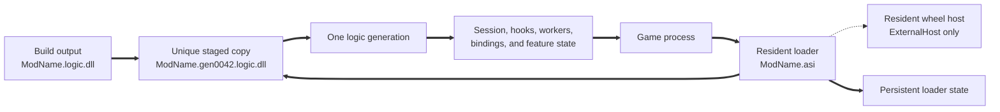
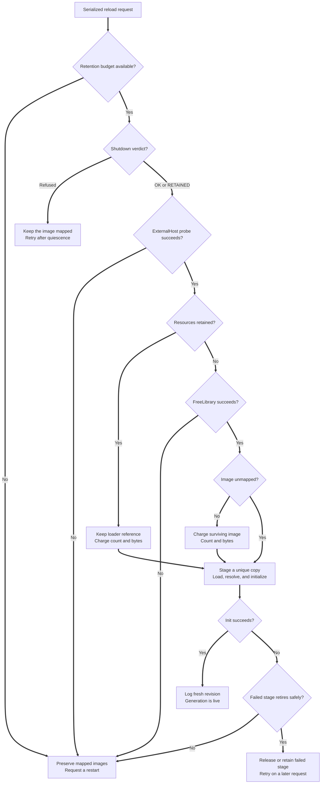

# Hot-reload development guide

> [!IMPORTANT]
> **The reference pair supports INI Consume changes without loader-policy edits.**
>
> Successful teardown permits a fresh generation even when the retired DLL stays mapped. The development loader retains images within count and byte limits.
>
> A failed callback drain, worker join, or consumer hook restoration blocks retirement. The loader never reinitializes an old image as a reload fallback.

Split the mod into a resident loader and a replaceable logic DLL.

| Binary              | Role                                        | Lifetime         |
|---------------------|---------------------------------------------|------------------|
| `ModName.asi`       | Stages, loads, and replaces the logic DLL   | The game session |
| `ModName.logic.dll` | Hooks, features, config, and input bindings | One generation   |

This guide defines DetourModKit unload guarantees, module pin sources, and the staged-generation pattern for repeatable reloads.

Use unique staged names and bounded retained generations for mods that consume gamepad input or layer XInput hooks.

Debug presets compile the [reference pair](../../../examples/staged_reload/) to check current API use. The [permanent proofs](#proof-pointers) exercise its sources. [The examples contract](../../../examples/README.md) defines ownership and compatibility.

## Why split the mod

A normal DLL development cycle discards the current game session after each code change. The restart also discards the exact game state that exposed a defect. A resident loader removes both costs from most logic changes.

The split creates one stable control plane and a sequence of logic generations. The loader owns reload requests, staged files, and the unload decision. Cross-generation feature state also belongs in the loader when a mod needs it. In the reference topology, each generation owns its `Session`, hooks, workers, subscriptions, callbacks, and feature state.


```mermaid
flowchart LR
    Build["Build output<br/>ModName.logic.dll"] ==> Stage["Unique staged copy<br/>ModName.gen0042.logic.dll"]
    Game["Game process"] ==> Loader["Resident loader<br/>ModName.asi"]
    Loader -.-> Host["Resident wheel host<br/>ExternalHost only"]
    Loader ==> State["Persistent loader state"]
    Loader ==> Stage
    Stage ==> Logic["One logic generation"]
    Logic ==> Session["Session, hooks, workers,<br/>bindings, and feature state"]
    Session ==> Game
```

The loader maps a unique copy, so the linker can replace the next build output while the game runs.

## Start with the reference pair

Study the checked-in example before adaptation to a mod project.

| File | Use |
| --- | --- |
| [`mod_loader.cpp`](../../../examples/staged_reload/mod_loader.cpp) | Own the control thread, wheel host, stage copies, lease probe, unload probe, and restart verdict. |
| [`mod_logic.cpp`](../../../examples/staged_reload/mod_logic.cpp) | Own one `Session`, `HookStack`, worker set, input scope, and typed `Shutdown()` result. |
| [`protocol.h`](../../../examples/staged_reload/protocol.h) | Carry a fixed-width request, ABI revision, generation id, and wheel-host table pointer across the DLL boundary. |
| [`examples/CMakeLists.txt`](../../../examples/CMakeLists.txt) | Keep the loader on `DetourModKit::WheelHost` and the logic DLL on the full archive. |

Build the pair with either Debug preset:

```bash
git submodule update --init --recursive

cmake --preset mingw-debug
cmake --build build/mingw-debug --target dmk_example_staged_loader dmk_example_staged_logic --parallel

cmake --preset msvc-debug
cmake --build build/msvc-debug --target dmk_example_staged_loader dmk_example_staged_logic --parallel
```

Run the MSVC commands from an x64 Developer Command Prompt.

The default `DMK_EXAMPLE_MOD_NAME` is `StagedExample`. Set it in [`examples/CMakeLists.txt`](../../../examples/CMakeLists.txt). If an ASI host loads the pair, rename the loader DLL to `<name>.asi`. Put `<name>.logic.dll` beside it.

Rebuild both reference DLLs together after a protocol change.

The C protocol permits different loader and logic-DLL toolchains with compatible x64 layouts and the same calling convention. Verify the deployed mixed pair with a lifecycle host before use.

Treat the request layout, export signatures, and each export's result values as one versioned contract. Identical export names do not establish ABI compatibility. A Boolean `Shutdown()` check cannot distinguish `DMK_STAGED_RELOAD_OK` from `DMK_STAGED_RELOAD_RETAINED`. Apply the [retained-generation policy](#define-a-retained-generation-policy) in both binaries.

The example loads its default wheel binding and optional gamepad combos from `<name>.ini`:

```ini
[Input]
DemoCombo=WheelUp,Gamepad_DpadUp
DemoCombo.Consume=true
```

Set `DemoCombo.Consume=false` to disable suppression for that combo. Reload the logic generation to read the edited INI. The reference pair requires no loader rebuild for this change.

## Choose the ownership topology

The ownership choice controls which image receives DetourModKit module references.

| Concern | DetourModKit in the logic DLL | DetourModKit in a persistent host |
| --- | --- | --- |
| Recommended use | Normal mod development | A host that must unmap every accepted generation |
| Development and release code | Identical mod ownership | Different ownership between development and release |
| DetourModKit objects | Owned by each logic generation | Owned by the resident host |
| Logic DLL contents | Full archive plus mod code | Mod callables and generation state, but no DetourModKit objects |
| Reload cost | Full `Session` teardown and restart | Host services remain live |
| Unmap limit | A permanent logic-side pin retains the image | Retained consumer callables or unresolved code paths refuse unmap |
| Boundary | Stable C exports. A table is optional. | A versioned C table is required |

Use the logic-DLL topology unless a measured retained-image cost requires the persistent host. Read [Topology: DetourModKit in the logic DLL](#topology-detourmodkit-in-the-logic-dll) for its contract. Read [Advanced topology: DetourModKit in a persistent host](#advanced-topology-detourmodkit-in-a-persistent-host) for the alternative.

## What pins the module that hosts DetourModKit

Some subsystems take counted module references on the module that links the archive. `FreeLibrary` releases one reference, so success alone does not prove an unmap. A later `LoadLibrary` on the same path reuses an image that remains mapped. The [Windows reference-count contract](https://learn.microsoft.com/en-us/windows/win32/api/libloaderapi/nf-libloaderapi-freelibrary) defines this distinction.

| Source | `ModulePinReason` | Reference taken | Released |
| --- | --- | --- | --- |
| A live inline, mid, or VMT hook | `Hook` | Before hook publication | After proved teardown. A failed proof retains the reference. |
| A `StoppableWorker` | `Worker` | Before thread start | After join. A detach or failed join retains the reference. |
| The bootstrap worker | `Bootstrap` | Before thread start | Immediately before its terminal `FreeLibraryAndExitThread`. |
| The async logger writer | `AsyncLogger` | Before thread start | After join. A detach or failed join retains the reference. |
| The memory-cache reader storage | `MemoryCache` | Before reader admission opens | After reader drain. A timeout retains the reference and storage. |
| The memory-cache cleanup thread | `MemoryCache` | Before thread start | After join. A detach retains the reference. |
| The input poll thread | `InputPoller` | Before thread start | After join. A detach or failed join retains the reference. |
| The lifecycle reaper | `LifecycleReaper` | Before thread start | Never. The process-lifetime thread owns this permanent reference. |
| A wheel binding (local `MessageHook`) | `MessageHookKeepalive` | Before the first hook publication | On publication failure only. Success makes it permanent because a selected callback can run after `UnhookWindowsHookEx`. |
| XInput interception self-reference | `XInputKeepalive` | Before hook creation | On install rollback or proved clean uninstall. Retention keeps it permanently. |
| XInput provider reference | `XInputTarget` | Before hook creation | With `XInputKeepalive`. It pins the provider module, not the DMK host module. |

The permanent wheel reference enters the intentional-leak tally after successful publication, not at teardown. A teardown delta therefore reads zero for a current wheel keepalive. Read open references through `diagnostics::module_pin_count(reason)`, which stays readable after `~Session`. These counters describe one linked DMK instance, not every Windows reference to its image.

A retained XInput set has one `XInputKeepalive` plus one or two `XInputTarget` references. The [retention policy](#define-a-retained-generation-policy) also covers teardown leaks without module pins.

XInput retention also logs each witness and target address. The next staged generation's first sink open erases those lines under the default `LogOpenMode::Truncate`. Set `ModInfo::log_open_mode = LogOpenMode::Append` to keep them across generations. If the loader needs a separate copy, record the lines in loader-owned storage.

The resident wheel host keeps the wheel callback and its keepalive in the loader. Configure [`input::Input::Settings`](../../../include/DetourModKit/input.hpp) before the first `start()`:

- Set `wheel_backend` to `input::Input::WheelBackend::ExternalHost`.
- Set `wheel_host` to the resident table that `wheel_host_start` fills.
- Keep `wheel_host_required = true` to reject host failure instead of local fallback.

The table must outlive the input engine. With `wheel_host_required = false`, a start-time host failure selects `MessageHook` and can pin the logic image. A successful lease close is necessary but does not authorize retirement. The [reload sequence](#reload-sequence-staged-generations) applies the remaining checks.

The checked-in [`staged_reload` pair](../../../examples/staged_reload/) shows the loader-side probe and unmap order. The [input design note](../../design/input.md) owns the backend contract.

## Reload sequence (staged generations)

Keep DetourModKit linked in the logic DLL, exactly as in the release build. Only the loader is development-specific.

Before teardown, reserve count capacity for both the current generation and a failed successor. Check retained bytes plus the current file size before teardown. Check the successor file size against the available byte budget before its load.

1. Serialize reload requests.
2. Call `Shutdown()` off the loader lock. If it refuses, stop the current reload. Preserve the mapped image after a refusal. Log each refusal.
3. With `ExternalHost`, open a loader probe lease. If it opens, close that probe lease. If either call fails, request a game restart.
4. If `Shutdown()` returns `DMK_STAGED_RELOAD_RETAINED`, keep the loader reference. Otherwise, save a code address and call `FreeLibrary` once. If release fails, request a restart.
5. After reference release, probe the saved address before any successor load. Charge every retained generation against both budgets.
6. Copy the rebuilt DLL to a unique staged name. Call `LoadLibrary` on the copy.
7. Resolve `Init`, `Shutdown`, and `Revision` with `GetProcAddress`. With `ExternalHost`, supply the resident table in the generation request. Call `Init()` for the new image.
8. After `Init()` succeeds, log the exported build revision.


```mermaid
flowchart TD
    Request["Serialized reload request"] ==> Budget{"Retention budget available?"}
    Budget ==>|No| Restart["Preserve mapped images<br/>Request a restart"]
    Budget ==>|Yes| Shutdown{"Shutdown verdict?"}
    Shutdown ==>|Refused| Retry["Keep the image mapped<br/>Retry after quiescence"]
    Shutdown ==>|OK or RETAINED| Lease{"ExternalHost probe succeeds?"}
    Lease ==>|No| Restart
    Lease ==>|Yes| Verdict{"Resources retained?"}
    Verdict ==>|Yes| Retain["Keep loader reference<br/>Charge count and bytes"]
    Verdict ==>|No| Release{"FreeLibrary succeeds?"}
    Release ==>|No| Restart
    Release ==>|Yes| Probe{"Image unmapped?"}
    Probe ==>|No| Account["Charge surviving image<br/>Count and bytes"]
    Probe ==>|Yes| Prepare["Stage a unique copy<br/>Load, resolve, and initialize"]
    Retain ==> Prepare
    Account ==> Prepare
    Prepare ==> Result{"Init succeeds?"}
    Result ==>|Yes| Live["Log fresh revision<br/>Generation is live"]
    Result ==>|No| Cleanup{"Failed stage retires safely?"}
    Cleanup ==>|No| Restart
    Cleanup ==>|Yes| Idle["Release or retain failed stage<br/>Retry on a later request"]
```


Never load two generations by the same file name. If the loader maps the build output, the path stays locked and a rebuild cannot replace it. A unique staged name gives every generation a fresh image. It prevents stale-image reuse and replay of function-local `static` state.

### Define a retained-generation policy

Retirement ends the generation's feature behavior. Unmap releases its image. A retained XInput chain can still forward calls after retirement.

Use bounded retained generations with either wheel backend. `ExternalHost` removes the wheel pin from the logic image, but XInput retention remains possible.

The example distinguishes successful feature teardown from image reclamation. `Shutdown()` returns zero after an unsafe teardown, `DMK_STAGED_RELOAD_OK` after clean retirement, or `DMK_STAGED_RELOAD_RETAINED` after retirement with resources.

For `DMK_STAGED_RELOAD_RETAINED`, keep the loader's own module reference until process exit. A leak counter does not prove that the leaked resource holds a module pin.

The development policy accepts leak counts after the [Shutdown sequence](#topology-detourmodkit-in-the-logic-dll) succeeds. It does not authorize live feature callbacks, abandoned workers, or failed consumer hook restoration. Accept the sample's verdict only after the [thread and TLS preconditions](#threads-tls-and-static-constructors) hold.

`LeakSubsystem::Input` combines several causes. An XInput pin does not attribute every Input leak to XInput. The example needs no such attribution because it retains its own reference.

An inline or mid hook retains its executable route when teardown cannot safely reclaim its storage. Causes include a failed idle proof, a refused or timed-out process coordinator, and a newer overlapping route in any participant. The retained route keeps its module reference, so the image stays mapped. DMK records a `LeakSubsystem::HookManager` leak and logs the cause. Retained routes preserve their dependencies under the [process coordinator contract](../../design/hooking.md#process-route-coordinator). The reference sample refuses retirement after any new `HookManager` leak during `HookStack::clear()`, even when target restoration succeeds.

Each linked copy with a published trap gateway retains one executable page and one data page, even after clean image unmap. The [generation resource proof](../../design/testing.md#generation-resource-proof) records the budget for executable bytes on each toolchain.

Do not force an unmap. The retained references protect code that can still execute.

Do not reinitialize a retired or refused image as a reload fallback. Its globals and function-local statics retain prior state. A refused `Shutdown()` can leave partial teardown. Keep its dependencies valid until teardown succeeds or the process exits.

Budget retained generations by both count and total staged-file bytes. The reference limits are 32 retained generations and 128 MiB of staged-file bytes. The reference loader uses `std::filesystem::file_size`, not PE `SizeOfImage`, committed memory, or working-set size. This limit excludes heap allocations, retained route storage, trap pages, and runtime TLS indices. Measure those resources separately for the actual mod.

## Build, reload, and inspect

After wheel-host startup succeeds, the reference loader attempts its first load.

Use one repeatable development loop:

1. Change logic-DLL code.
2. Build the stable `<name>.logic.dll` output.
3. Press F10 while the game owns the foreground window.
4. Read `<name>.loader.log` beside the loader for the generation id, revision, retention totals, and failures.
5. If the loader requests a restart, stop the reload cycle.

The loader emits no separate success record for a clean unmap.

The reference loader removes unlocked staged copies from earlier sessions. Windows keeps a mapped stage file locked, so a retained image leaves its file in place. Do not delete or overwrite that file while its image remains mapped.

Export a revision that identifies the exact build.

A generated build id or binary hash identifies build changes more precisely than `__DATE__` and `__TIME__`. Those timestamps change only when their translation unit recompiles. A source-control revision alone also misses uncommitted edits and build-option changes. An unchanged revision does not prove stale bytes.

Keep debugger symbols from the same build as each staged DLL. A debugger can cache symbols from the prior generation. Reload the module symbols after each accepted generation if source lines or breakpoints still name old code.

## What DetourModKit guarantees across an unload

### Inline detour removal requires caller quiescence

A prologue rewrite uses execute traps instead of a process-wide thread freeze. The backend removes execute permission and tracks patch windows during the rewrite. Its vectored handler retries closed-window faults and relocates instruction pointers inside a tracked window. That handler does not drain detour bodies or code outside those windows. Route reclamation separately suspends other threads in turn for its idle proof. The [hook note](../../design/hooking.md#concurrency-model) defines that proof.

A fixed sleep cannot prove quiescence. A detour counter also misses a caller that selected the detour before its counter entry. The [`inline_at` contract](../../../include/DetourModKit/hook.hpp) requires caller quiescence before teardown. The reference sample joins its heartbeat worker, which is its target's only caller. A game inline hook requires an equivalent proof for game-owned callers.

DMK owns rundown for mid callbacks and counted displaced execution. The [`mid_at` contract](../../../include/DetourModKit/hook.hpp) requires callers to quiesce saved contexts outside that execution.

`Shutdown()` must refuse retirement while any source can still enter generation-owned feature code. Such sources include window procedures, timers, and third-party overlay callbacks outside DMK's typed drain. Remove those registrations and drain their callbacks while their code and state remain valid. The loader must keep the DLL mapped after a refusal.

### Layered hooks unwind newest-first

When several handles target the same address, destroy them newest-first. `hook::HookStack` enforces this order for its own handles in its destructor, move-assignment, and `clear()`. Coordinate teardown across stacks and compatible participants that share a target. An older backend retains its route when target bytes identify a newer layer. Newest-first order is necessary, but quiescence and target-byte checks still determine whether restoration succeeds.

### Session teardown owns one instance's subsystems

The [`Session` contract](../../../include/DetourModKit/session.hpp) owns the subsystem teardown order within one linked DMK instance. Separate logic DLLs that link the archive own separate subsystem instances. The default logger uses storage without a CRT destructor. Clean teardown flushes and closes its sink. The default `LogOpenMode::Truncate` starts a clean log on the first sink open. `LogOpenMode::Append` preserves prior generation records.

Destroy the `Session` before `FreeLibrary`. If code skips this step, the async writer's module reference can retain the image and its logger resources.

### State ownership across reloads

A unique staged image starts with fresh logic state, even when an inert predecessor remains mapped.

| State | Owner | Result across replacement | Required action |
| --- | --- | --- | --- |
| Logic globals and function-local statics | Logic generation | Fresh in the successor | Recreate them in `Init()`. |
| `Session`, hooks, workers, and bindings | Logic generation | Retired in the predecessor | Drain them in `Shutdown()` and on every failed `Init()` path. |
| Profiler ring samples | Logic generation | Generation-local | Export required samples before `Shutdown()`. |
| Direct game-memory writes | Game process | Preserved | Track and revert raw patches before the unload drain. |
| INI file | File system | Preserved | Load it again from the new generation. |
| Cross-generation feature state | Resident loader | Preserved | Pass fixed-width data through the versioned C request. |

Do not pass C++ containers, pointers with ownership, exceptions, or standard-library objects across a mixed-toolchain boundary. Keep every pointer in the request valid for its documented lifetime. Persistent state must not retain pointers into an unmapped image or objects that its teardown destroys.

### Threads, TLS, and static constructors

Each DMK TLS index returns with its last owner. A clean generation therefore returns every DMK index that it reserved. The [`hook_lifecycle()` contract](../../../include/DetourModKit/diagnostics.hpp) owns diagnostics teardown. A retained mid route and a namespace-scope dispatcher keep their indices while their image stays mapped. The [generation resource proof](../../design/testing.md#generation-resource-proof) records the budget for each toolchain.

In the MinGW resource fixture, each fresh initialized `libwinpthread-1.dll` load consumes one TLS index that its unload does not return. The host holds one initialized runtime reference before the baseline. A new logic generation does not incur that runtime-load cost when it reuses the resident runtime.

Runtime residency does not prove destructor safety. GCC's emulated TLS registers a cleanup function with the thread runtime. If a resident runtime retains a callback into the logic image, each affected thread must exit before unmap. A C++ exception can also initialize runtime TLS without an explicit mod `thread_local` declaration. The GCC sources define [emulated TLS cleanup](https://github.com/gcc-mirror/gcc/blob/releases/gcc-15.1.0/libgcc/emutls.c) and [exception TLS](https://github.com/gcc-mirror/gcc/blob/releases/gcc-15.1.0/libstdc%2B%2B-v3/libsupc%2B%2B/eh_globals.cc).

This restriction also covers a loader thread that calls `Init()` or `Shutdown()`. A join of mod workers alone does not drain TLS on that thread. Keep each cleanup function mapped until its thread exits, or use generation-specific control threads that exit before unmap.

The [reference pair](../../../examples/CMakeLists.txt) embeds its MinGW runtimes. The [winpthreads callback registry](https://github.com/mingw-w64/mingw-w64/blob/v13.0.0/mingw-w64-libraries/winpthreads/src/thread.c) belongs to its runtime instance. The [proof DLLs](../../../tests/lifecycle/CMakeLists.txt), `staged_generation_dll` and `staged_example_logic`, import `libwinpthread-1.dll` under MinGW. Their TLS behavior does not establish the embedded runtime's budget or callback lifetime. Measure the exact runtime linkage and thread lifetimes before deployment.

The reference loader calls every generation from one resident control thread. If that thread retains a cleanup callback into a logic image, keep the image mapped until process exit. DMK counters do not track runtime TLS callbacks.

Join every consumer-owned thread in `Shutdown()`, before the `Session` teardown. A thread that outlives image unmap executes unmapped code.

Use [`dmk::StoppableWorker`](../../../include/DetourModKit/detail/worker.hpp) for cooperative workers. Normal destruction from another thread requests stop and joins without a timeout. Self-thread teardown transfers the join and module reference to the lifecycle reaper. Neither `is_running() == false` nor self-thread teardown proves that the body exited.

A failed worker join can detach the body and retain its module reference. The example checks `Worker` pins after heartbeat destruction, before hook or `Session` teardown. A residual pin permanently refuses retirement and preserves those dependencies, even after the worker owner disappears. The example has no independent thread-exit proof, so a later body exit does not permit a retry to retire it. This guard applies to `Shutdown()` and initialization rollback.

When teardown lacks permission to block, the worker detaches without a stop request and retains its module reference. A prior stop request remains visible, but this branch adds none. If that branch must terminate the body, publish a separate cancellation flag with sufficient lifetime.

When `FreeLibrary` drops the final reference, Windows sends `DLL_PROCESS_DETACH` without individual `DLL_THREAD_DETACH` notices. The [Windows DLL entry-point contract](https://learn.microsoft.com/en-us/windows/win32/dlls/dllmain) also applies loader-lock restrictions to CRT static constructors and destructors. At process termination, the example calls [`Session::abandon()`](../../../include/DetourModKit/session.hpp) before CRT destruction. Keep logic setup and teardown in explicit off-loader-lock `Init()` and `Shutdown()` calls. Keep the resident loader mapped for its control thread and wheel-host lifetime.

## Topology: DetourModKit in the logic DLL

This is the recommended topology, combined with the staged-generation loader above. Development and production run identical mod code, and each cycle exercises the production teardown.

If cleanup needs a worker or game-thread route, complete it before you stop that worker or retire that route.

Apply this `Shutdown()` order:

1. Stop and join every consumer worker.
2. Drop dispatcher subscriptions. Quiesce their emitters.
3. Retire external callback registrations and quiesce every hook caller.
4. Revert direct game-memory patches after their writers stop.
5. Clear the `HookStack` newest-first and latch any restore failure.
6. Call `prepare_logic_dll_unload*` and require `SafeToUnload`.
7. Destroy the `Session`.
8. Read the module-pin and leak counters, then compute the retirement verdict.

The [`prepare_logic_dll_unload*` preconditions](../../../include/DetourModKit/session.hpp) require consumer hooks and subscriptions to retire before the typed drain. Keep callback state valid through that drain, which can deliver a held binding's final release callback.

The [`Subscription` unload contract](../../../include/DetourModKit/detail/event_dispatcher.hpp) requires more than handler rundown. Neither `reset()` nor `tombstone_and_wait()` proves that dispatcher snapshots released their callables. Before unmap, release every snapshot and retired entry that still owns a generation callable.

Apply the same obligations after partial `Init()` publication. The example starts input as its final fallible step. No later step requires rollback with a live poller. If adaptation adds later fallible work, rollback must also prove callback drain.

Read pin counters after `~Session`, because XInput retention occurs there. The counters remain readable after the `Session` is gone.

Latch the first hook restore failure across retries. Keep every saved original pointer and target-module reference after a failure. A retained inline route can still enter the detour.

Apply the [retained-generation policy](#define-a-retained-generation-policy) to either wheel backend. `ExternalHost` does not change the XInput verdict.

## Advanced topology: DetourModKit in a persistent host

Use this topology only when retained generations exceed the budget. It does not exercise the single-DLL release teardown.

The host links the archive and owns every DetourModKit object. The logic DLL links no DetourModKit archive. It reaches the host through a versioned C table. The [`logic_callback_dll` target](../../../tests/lifecycle/CMakeLists.txt) demonstrates this ownership split. A second archive instance has a separate ledger and pins the logic DLL again.

| Resource | Required owner | Reason |
| --- | --- | --- |
| Config registrations | Host | Drain references to generation-owned values before unmap. |
| `input::Input::start()` | Host | The poll-thread module reference must land on the host. |
| Hooks with logic-DLL detours | Host, with newest-first teardown | A retained hook can reach a logic-DLL detour. |

`prepare_logic_dll_unload(binding_names)` retires named input bindings and all config callbacks in that DMK instance. It closes callback admission during the drain and requests watcher and reload-servicer stop. A successful drain clears config registrations and reopens input admission. Its deadline bounds waits for DMK callbacks and workers. Consumer release callbacks and capture destructors can exceed that deadline, as `session.hpp` specifies.

With its preconditions met, `SafeToUnload` proves the selected input callables and old config lifecycle no longer retain consumer callbacks. It does not drain game hooks or external registrations. Dispatcher snapshots and consumer threads require separate quiescence. Every other status refuses `FreeLibrary`. Keep the DLL mapped and retry from an off-loader-lock control thread. [`[B-74]`](../../design/lifecycle.md) owns the timeout and admission rules.

`prepare_logic_dll_unload_all()` clears every input binding in that DMK instance but keeps the poll thread alive. The named form preserves unrelated input bindings, but both forms clear every config registration in the shared instance. Coordinate that config teardown when several logic DLLs share a persistent host. Neither form reaches registrations in a separately linked DMK instance.

After `FreeLibrary`, check the saved export address before any successor load. Use `GetModuleHandleExW(GET_MODULE_HANDLE_EX_FLAG_FROM_ADDRESS | GET_MODULE_HANDLE_EX_FLAG_UNCHANGED_REFCOUNT)`. This query observes the current mapping without ownership and cannot identify which reference retains an image. Never pass its returned handle to `FreeLibrary`. Concurrent module activity can also reuse addresses, as the [Windows probe contract](https://learn.microsoft.com/en-us/windows/win32/api/libloaderapi/nf-libloaderapi-getmodulehandleexw) explains. If unmap lacks proof, preserve retention accounting and use a unique successor image.

### Binding guards during the drain

[`[B-74]` in the lifecycle note](../../design/lifecycle.md) owns the transaction contract and the binding-guard drain rules. The `BindingGuard` contract in `input.hpp` owns the lock and join rule for guard destruction. The `prepare_logic_dll_unload` contract in `session.hpp` states what a retained guard still does.

## Repeated calls into a persistent host

In a persistent host, later generations reuse the same DMK service instances. These service contracts do not establish mod-state idempotency for repeated `Init()` in one logic image.

| API                                        | Second-call behavior                                  | Do first                                |
|--------------------------------------------|-------------------------------------------------------|-----------------------------------------|
| `Logger::configure`                        | Reconfigures transactionally and never truncates      | Nothing                                 |
| `hook::inline_at` / `mid_at` (per address) | `TargetAlreadyHookedByThisKit` under strict refusal   | Drop the prior `Hook` handle            |
| `config::bind_*`                           | Replaces the item and its setter in place             | Nothing                                 |
| `config::press_combo` / `hold_combo`       | Replaces the config item, appends the input binding   | `input::Input::remove_bindings_by_name` |
| `input::register_combo`                    | Appends a second binding under the same name          | `input::Input::remove_bindings_by_name` |
| `input::Input::start`                      | With a live poller, re-arms callbacks and preserves its settings. | Shut down the poller before new settings. |
| `bootstrap_attach` / `bootstrap`           | Returns a failed `Result` while a session is attached | `shutdown_and_wait()`                   |

An active or pending callback drain makes `Input::start()` return `ShutdownInProgress`.

`input::register_combo` is append-only. The engine treats `name` as a label, not a key. Under staged generations, re-registration from each generation's `Init()` is the supported path. `config::bind_*` replaces the item in place, and the previous generation's `Shutdown()` retired its bindings.

## Diagnose a failed reload

| Symptom | Check | Safe response |
| --- | --- | --- |
| The revision does not change. | Check the staged file name and exported revision source. | If the revision translation unit did not recompile, compare DLL hashes. |
| `Shutdown()` refuses the unload. | Check parked callbacks, workers, subscriptions, hook restore, and pin counters. | Keep the DLL mapped. Retry recoverable refusals off the loader lock. Restart after a latched worker or hook failure. |
| The lease probe fails. | Check both the open and close status. | Keep the DLL mapped and request a game restart. |
| `FreeLibrary` fails. | Check the loader's module handle and release result. | Request a game restart. |
| The retired address stays mapped. | Check the successful teardown verdict and retention budget. | Record retention and load a unique successor. |
| The stage copy fails. | Check that the build completed and that the source file is readable. | No generation is live. Retry on a later request. |
| Export resolution fails. | Check `Init`, `Shutdown`, `Revision`, calling convention, and protocol revision. | Retire the failed stage through the same teardown and retention checks. |
| A breakpoint names old source lines. | Check the module name, revision, and loaded symbol file. | Reload debugger symbols for the current staged image. |
| A reload starts from another application. | Check the foreground-process guard around `GetAsyncKeyState`. | Accept the hotkey only while the game owns the foreground window. |
| `Init()` returns zero. | Check rollback of each published resource, including callback drain and hook restoration. | Call the failed stage's `Shutdown()`. If safe retirement lacks proof, retain the loader reference and request a restart. |

## Proof pointers

[`test_event_dispatcher.cpp`](../../../tests/test_event_dispatcher.cpp) verifies retained snapshot ownership in `EventDispatcherEmitOwnerRelease.HandlerRunningAfterResetKeepsTheOwnership` and `HandlerRunningAcrossClearKeepsTheOwnership`.

[`test_logic_dll_unload.cpp`](../../../tests/lifecycle/test_logic_dll_unload.cpp) owns the callback-rundown and unmap proofs. [`staged_generation_soak.cpp`](../../../tests/lifecycle/staged_generation_soak.cpp) contains these staged-generation proofs:

| `Lifecycle` test | Verified scope |
| --- | --- |
| `StagedGenerationSoakReloadsWithFreshBytes` | Clean `ExternalHost` generations load fresh bytes and unmap. |
| `StagedGenerationLocalWheelRetentionStaysMapped` | Fresh local-wheel generations coexist with retained predecessors. CTest skips this case without a window station. |
| `StagedGenerationForeignXInputRetainsThePair` | One local generation retains XInput, forwards calls, and survives foreign hand-back. |

[`staged_example_reload.cpp`](../../../tests/lifecycle/staged_example_reload.cpp) exercises both reference sources with a required resident wheel host and a synthetic controller. Its executable calls loader functions directly. It does not exercise the loader DLL entry point, control-thread startup, or F10 path.

| `Lifecycle` test | Verified scope |
| --- | --- |
| `StagedExampleConsumeLoadsFreshRetainedSuccessor` | INI gamepad Consume, an active wheel-host lease, retained XInput, distinct successor bytes, retired callbacks, and Consume on/off/on transitions. |
| `StagedExampleUnpinnedLeakKeepsLoaderReference` | A leak without a pin retains the loader reference and permits fresh bytes. |
| `StagedExampleUnsafeTeardownRefusesSuccessor` | A simulated hook-teardown failure blocks a successor and repeated `Init()`. |
| `StagedExampleParkedCallbackRefusesThenRetires` | A parked callback refuses retirement after worker join. Callback release permits a retry, clean unmap, and a fresh successor. |
| `StagedExampleWorkerJoinFailureRefusesSuccessor` | A failed join preserves the parked worker's dependencies and refuses every successor, including after native thread exit. |
| `StagedExampleWorkerJoinFailureStopsRollback` | The rollback helper preserves dependencies after a failed join, including retries after the worker owner disappears. |
| `StagedExampleBudgetsStopBeforeTeardown` | Count and byte limits preserve the current generation. |
| `StagedExampleFailedInitRollsBack` | Failed initialization retires and unmaps before a retry. |
| `StagedExampleMissingShutdownRequiresRestart` | Missing teardown exports preserve the mapped stage and require a restart. |

Each scenario runs in a separate process under `ctest -L lifecycle-proof`.

## Related documentation

- [Config hot-reload](config-hot-reload.md) contains the INI reload API and its thread-safety contract.
- [The lifecycle note](../../design/lifecycle.md) contains `[B-44]`, `[B-73]`, and `[B-74]`.
- [The config note](../../design/config.md) contains the combo string syntax, and the opt-out sentinel.
- [`worker.hpp`](../../../include/DetourModKit/detail/worker.hpp) contains `dmk::StoppableWorker`.
- [Migration from v3.x to v4](../../migration/migrating-v3-to-v4.md) states the reload behavior change for consume and wheel users.
