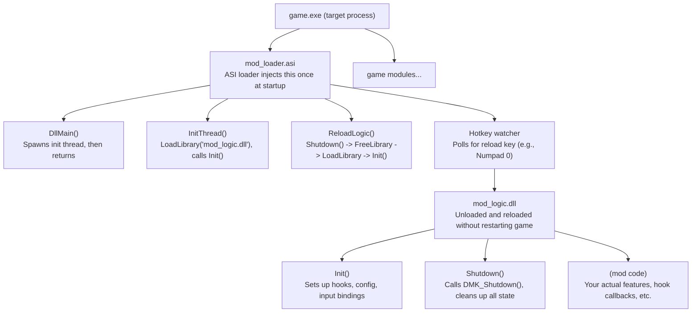
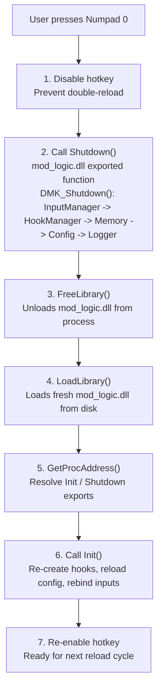

# Hot-Reload Development Guide for DetourModKit Mods

## Problem Statement

The standard game mod development cycle requires restarting the game after every DLL rebuild:

```text
RE / Code Change -> Build DLL -> Kill Game -> Relaunch Game -> Wait for Load -> Test -> Repeat
```

For large games with 30s-2min+ load times, this creates significant dead time. A single day of active development can involve 30-50+ restarts, wasting 1-3 hours just on loading screens.

## Solution: Two-DLL Hot-Reload Architecture

Split your mod into two binaries:

| Binary           | Role                                   | Lifetime                      | Rebuild Frequency                       |
|------------------|----------------------------------------|-------------------------------|-----------------------------------------|
| `mod_loader.asi` | Thin loader stub                       | Lives for entire game session | Rarely (only when loader logic changes) |
| `mod_logic.dll`  | All mod code (hooks, features, config) | Loaded/unloaded on demand     | Every iteration                         |

The loader watches for a reload hotkey. When pressed, it tears down the logic DLL and reloads it from disk - **no game restart required**.

### Architecture Diagram



### Data Flow: Reload Sequence



---

## Implementation Guide

### Step 1: Define the Logic DLL Interface

The logic DLL exports exactly two C functions. Keep the interface minimal and stable so the loader rarely needs rebuilding.

**mod_logic/exports.hpp** (shared between loader and logic):

```cpp
#pragma once

// These are the only exported symbols from mod_logic.dll.
// Both use C linkage to avoid name mangling across compilers.

// Called after LoadLibrary. Sets up all hooks, config, input bindings.
// Returns true on success, false on initialization failure.
using InitFn = bool (__cdecl *)();

// Called before FreeLibrary. Tears down everything cleanly.
// Must be safe to call even if Init() partially failed.
using ShutdownFn = void (__cdecl *)();

// Export names used by GetProcAddress
constexpr const char* INIT_EXPORT     = "Init";
constexpr const char* SHUTDOWN_EXPORT = "Shutdown";
```

### Step 2: Implement the Logic DLL

This is where your actual mod code lives. It links against DetourModKit as a static library.

**mod_logic/dllmain.cpp:**

```cpp
#include "exports.hpp"
#include <DetourModKit.hpp>
#include <windows.h>

// --- Forward declarations ---
static bool setup_hooks();
static void setup_config();
static void setup_input();

// --- State ---
// All mod state lives here. It is reset on every reload.
static HMODULE s_this_module = nullptr;

// --- Exported functions ---

extern "C" __declspec(dllexport) bool Init()
{
    try
    {
        DMKLogger::configure("MyMod", "mod_logic.log", "%Y-%m-%d %H:%M:%S");
        auto& logger = DMKLogger::get_instance();
        logger.set_log_level(DMKLogLevel::Debug);
        logger.info("mod_logic: Init() called");

        setup_config();

        if (!setup_hooks())
        {
            logger.error("mod_logic: Hook setup failed - rolling back");
            DMK_Shutdown();
            return false;
        }

        setup_input();

        logger.info("mod_logic: Initialization complete");
        return true;
    }
    catch (const std::exception& e)
    {
        // C functions must not propagate exceptions across DLL boundaries.
        // Log to debugger output since Logger may not be initialized.
        std::string msg = std::string("mod_logic Init() exception: ") + e.what();
        OutputDebugStringA(msg.c_str());
        DMK_Shutdown();
        return false;
    }
    catch (...)
    {
        OutputDebugStringA("mod_logic Init() unknown exception");
        DMK_Shutdown();
        return false;
    }
}

extern "C" __declspec(dllexport) void Shutdown()
{
    auto& logger = DMKLogger::get_instance();
    logger.info("mod_logic: Shutdown() called");

    // DMK_Shutdown handles the correct teardown order:
    // InputManager -> HookManager -> Memory cache -> Config -> Logger
    DMK_Shutdown();
}

BOOL APIENTRY DllMain(HMODULE hModule, DWORD reason, LPVOID)
{
    if (reason == DLL_PROCESS_ATTACH)
    {
        DisableThreadLibraryCalls(hModule);
        s_this_module = hModule;
        // Do NOT initialize here - Init() is called explicitly by the loader
    }
    return TRUE;
}

// --- Setup functions ---

static bool setup_hooks()
{
    auto& hm = DMKHookManager::get_instance();

    // Example: hook a game function by AOB pattern
    // auto result = hm.create_inline_hook_aob(
    //     "camera_update",
    //     game_base, game_size,
    //     "48 8B ?? ?? ?? ?? ?? 48 85 C0 74 ?? F3 0F",
    //     0,
    //     &detour_camera_update,
    //     reinterpret_cast<void**>(&original_camera_update)
    // );
    // return result.has_value();

    return true;
}

static void setup_config()
{
    // DMKConfig::register_float("Camera", "FOV", "Field of View",
    //     [](float val) { g_fov = val; }, 90.0f);
    // DMKConfig::load("mod_config.ini");
}

static void setup_input()
{
    // auto& input = DMKInputManager::get_instance();
    // input.start(...);
}
```

> [!TIP]
> Any background threads spawned from `Init()` (deferred scanning, periodic polling, async I/O, etc.) must be joined before `DMK_Shutdown()` returns - otherwise `FreeLibrary` will unload code pages that the thread is still executing from. The easiest way to get this right is to wrap them in [`DMKStoppableWorker`](../../include/DetourModKit/worker.hpp) and reset the owning pointer at the top of `Shutdown()`. See [Section 9](#9-background-thread-lifecycle) below.

### Step 3: Implement the Loader ASI

The loader is intentionally minimal. It should almost never need rebuilding.

**mod_loader/dllmain.cpp:**

```cpp
#include <windows.h>
#include <string>
#include <atomic>

// --- Configuration ---

// Reload hotkey - VK_NUMPAD0 (Numpad 0). Change as needed.
// Numpad keys are unlikely to conflict with game controls or InputManager bindings.
constexpr int RELOAD_KEY = VK_NUMPAD0;

// Name of the logic DLL (must be in same directory as the loader ASI)
constexpr const char* LOGIC_DLL_NAME = "mod_logic.dll";

// Polling interval for hotkey detection (milliseconds)
constexpr DWORD POLL_INTERVAL_MS = 100;

// Sleep durations (milliseconds)
constexpr DWORD CALLBACK_DRAIN_MS = 100;   // After Shutdown(): let in-flight callbacks return
constexpr DWORD FILE_SETTLE_MS    = 200;   // After FreeLibrary(): let file locks release

// --- Types ---

using InitFn     = bool (__cdecl *)();
using ShutdownFn = void (__cdecl *)();

// --- State ---

static HMODULE       s_loader_module  = nullptr;
static HMODULE       s_logic_module   = nullptr;
static InitFn        s_init_fn        = nullptr;
static ShutdownFn    s_shutdown_fn    = nullptr;
static std::string   s_logic_dll_path;
static std::atomic<bool> s_running{true};
static std::atomic<bool> s_reloading{false};

// --- Helpers ---

// Resolve the full path to mod_logic.dll relative to the loader ASI location
static std::string resolve_logic_dll_path()
{
    char path[MAX_PATH]{};
    GetModuleFileNameA(s_loader_module, path, MAX_PATH);

    std::string dir(path);
    const auto last_sep = dir.find_last_of("\\/");
    if (last_sep != std::string::npos)
    {
        dir = dir.substr(0, last_sep + 1);
    }

    return dir + LOGIC_DLL_NAME;
}

// Write to debugger output (always available, no logger dependency).
// Single OutputDebugStringA call prevents interleaving with other threads.
static void loader_log(const char* msg)
{
    char buf[512];
    const int len = snprintf(buf, sizeof(buf), "[mod_loader] %s\n", msg);
    if (len > 0 && static_cast<size_t>(len) < sizeof(buf))
        OutputDebugStringA(buf);
    else
        OutputDebugStringA("[mod_loader] (message truncated)\n");
}

// --- Load / Unload logic DLL ---

static bool load_logic_dll()
{
    loader_log("Loading logic DLL...");

    s_logic_module = LoadLibraryA(s_logic_dll_path.c_str());
    if (!s_logic_module)
    {
        DWORD err = GetLastError();
        std::string msg = "ERROR: LoadLibrary failed (error " + std::to_string(err) + "): "
                        + s_logic_dll_path;
        loader_log(msg.c_str());
        return false;
    }

    s_init_fn = reinterpret_cast<InitFn>(
        GetProcAddress(s_logic_module, "Init"));
    s_shutdown_fn = reinterpret_cast<ShutdownFn>(
        GetProcAddress(s_logic_module, "Shutdown"));

    if (!s_init_fn || !s_shutdown_fn)
    {
        loader_log("ERROR: Failed to resolve Init/Shutdown exports");
        FreeLibrary(s_logic_module);
        s_logic_module = nullptr;
        s_init_fn = nullptr;
        s_shutdown_fn = nullptr;
        return false;
    }

    if (!s_init_fn())
    {
        loader_log("ERROR: Init() returned false");
        FreeLibrary(s_logic_module);
        s_logic_module = nullptr;
        s_init_fn = nullptr;
        s_shutdown_fn = nullptr;
        return false;
    }

    loader_log("Logic DLL loaded and initialized successfully");
    return true;
}

static void unload_logic_dll()
{
    if (!s_logic_module)
    {
        return;
    }

    loader_log("Unloading logic DLL...");

    if (s_shutdown_fn)
    {
        s_shutdown_fn();
    }

    // Brief sleep to allow any in-flight hook callbacks to complete.
    // SafetyHook freezes threads during hook removal, but callbacks
    // that were already past the hook entry point need time to return.
    Sleep(CALLBACK_DRAIN_MS);

    FreeLibrary(s_logic_module);
    s_logic_module = nullptr;
    s_init_fn = nullptr;
    s_shutdown_fn = nullptr;

    loader_log("Logic DLL unloaded");
}

static void reload_logic_dll()
{
    // Guard against double-reload
    bool expected = false;
    if (!s_reloading.compare_exchange_strong(expected, true))
    {
        return;
    }

    loader_log("=== HOT RELOAD TRIGGERED ===");

    unload_logic_dll();

    // Brief delay to ensure file locks are released (build system may
    // still be writing the DLL when the hotkey is pressed)
    Sleep(FILE_SETTLE_MS);

    load_logic_dll();

    s_reloading.store(false);
    loader_log("=== HOT RELOAD COMPLETE ===");
}

// --- Main thread ---

static DWORD WINAPI LoaderThread(LPVOID /*param*/)
{
    s_logic_dll_path = resolve_logic_dll_path();

    // Initial load - do NOT exit if this fails.
    // The thread must stay alive so the reload hotkey can retry
    // (e.g., logic DLL not yet built on first launch).
    if (!load_logic_dll())
        loader_log("Initial load failed - press reload key to retry");

    // Poll for reload hotkey
    while (s_running.load())
    {
        if ((GetAsyncKeyState(RELOAD_KEY) & 0x8000) != 0)
        {
            reload_logic_dll();

            // Wait for key release to prevent rapid re-triggers
            while (GetAsyncKeyState(RELOAD_KEY) & 0x8000)
            {
                Sleep(50);
            }
        }

        Sleep(POLL_INTERVAL_MS);
    }

    // Final cleanup on game exit
    unload_logic_dll();

    return 0;
}

// --- Entry point ---

BOOL APIENTRY DllMain(HMODULE hModule, DWORD reason, LPVOID)
{
    if (reason == DLL_PROCESS_ATTACH)
    {
        DisableThreadLibraryCalls(hModule);
        s_loader_module = hModule;

        // Spawn loader thread to avoid Windows loader lock deadlock
        // Pass hModule so the thread can resolve paths relative to the ASI.
        HANDLE thread = CreateThread(nullptr, 0, LoaderThread, hModule, 0, nullptr);
        if (thread)
        {
            CloseHandle(thread);
        }
    }
    else if (reason == DLL_PROCESS_DETACH)
    {
        s_running.store(false);
        // Note: unload_logic_dll() is called by LoaderThread when it exits.
        // We do NOT call it here because DllMain(DETACH) holds the loader
        // lock, and Shutdown() may need threads to exit (which requires
        // the loader lock -> deadlock).
    }
    return TRUE;
}
```

### Step 4: CMake Build Configuration

Use a single CMakeLists.txt with a build option that switches between:

- **Production:** single ASI (all code in one binary)
- **Dev build:** two-DLL hot-reload (loader ASI + logic DLL)

```text
my_mod/
├── CMakeLists.txt              <- Top-level, defines both target configurations
├── external/
│   └── DetourModKit/           <- Git submodule
├── src/
│   ├── dllmain.cpp             <- Main entry point (production ASI)
│   ├── features/               <- Your mod feature code
│   │   ├── camera.cpp
│   │   └── camera.hpp
│   └── dev/
│       ├── loader_main.cpp     <- Loader ASI source (dev only)
│       └── logic_exports.cpp   <- Init/Shutdown exports (dev only)
└── config/
    └── mod_config.ini          <- Runtime configuration
```

**CMakeLists.txt:**

```cmake
cmake_minimum_required(VERSION 3.25)
project(MyMod VERSION 1.0.0 LANGUAGES CXX)

set(CMAKE_CXX_STANDARD 23)
set(CMAKE_CXX_STANDARD_REQUIRED ON)
set(CMAKE_CXX_EXTENSIONS OFF)

# -- DetourModKit ---------------------------------------------------------
add_subdirectory(external/DetourModKit)

# -- Dev build toggle -----------------------------------------------------
option(MY_MOD_DEV_BUILD "Two-DLL hot-reload configuration for development" OFF)

# -- Common source files (shared by both configurations) ------------------
set(COMMON_SOURCES
    src/dllmain.cpp
    src/features/camera.cpp
    # Add more source files as needed
)

# -- Game output directory ------------------------------------------------
set(GAME_BIN_DIR "D:/Games/SteamLibrary/steamapps/common/YourGame/bin64/plugins")

if(MY_MOD_DEV_BUILD)
    # =================================================================
    # Dev Build: two-DLL hot-reload (loader + logic)
    # =================================================================
    message(STATUS "DEV BUILD enabled -- building loader + logic DLL pair")

    # -- Loader ASI (thin stub, no DetourModKit, rarely rebuilt) -------
    add_library(mod_loader SHARED src/dev/loader_main.cpp)

    target_link_libraries(mod_loader PRIVATE kernel32 user32)

    set_target_properties(mod_loader PROPERTIES
        OUTPUT_NAME "MyMod"
        SUFFIX ".asi"
        PREFIX ""
        RUNTIME_OUTPUT_DIRECTORY "${GAME_BIN_DIR}"
        RUNTIME_OUTPUT_DIRECTORY_DEBUG "${GAME_BIN_DIR}"
        RUNTIME_OUTPUT_DIRECTORY_RELEASE "${GAME_BIN_DIR}"
        RUNTIME_OUTPUT_DIRECTORY_RELWITHDEBINFO "${GAME_BIN_DIR}"
    )

    # -- Logic DLL (all mod code, rebuilt frequently) ------------------
    add_library(mod_logic SHARED
        ${COMMON_SOURCES}
        src/dev/logic_exports.cpp
    )

    target_include_directories(mod_logic PRIVATE src)
    target_compile_definitions(mod_logic PRIVATE MY_MOD_DEV_BUILD)
    target_link_libraries(mod_logic PRIVATE DetourModKit)

    # Build to staging/ so the linker never conflicts with a game-locked
    # DLL. The loader copies from staging/ before LoadLibrary.
    set(GAME_STAGING_DIR "${GAME_BIN_DIR}/staging")

    set_target_properties(mod_logic PROPERTIES
        OUTPUT_NAME "MyMod_Logic"
        PREFIX ""
        # RUNTIME for .dll, LIBRARY for .dll.a (MinGW import lib)
        RUNTIME_OUTPUT_DIRECTORY "${GAME_STAGING_DIR}"
        RUNTIME_OUTPUT_DIRECTORY_DEBUG "${GAME_STAGING_DIR}"
        RUNTIME_OUTPUT_DIRECTORY_RELEASE "${GAME_STAGING_DIR}"
        RUNTIME_OUTPUT_DIRECTORY_RELWITHDEBINFO "${GAME_STAGING_DIR}"
        LIBRARY_OUTPUT_DIRECTORY "${GAME_STAGING_DIR}"
        LIBRARY_OUTPUT_DIRECTORY_DEBUG "${GAME_STAGING_DIR}"
        LIBRARY_OUTPUT_DIRECTORY_RELEASE "${GAME_STAGING_DIR}"
        LIBRARY_OUTPUT_DIRECTORY_RELWITHDEBINFO "${GAME_STAGING_DIR}"
        PDB_OUTPUT_DIRECTORY "${GAME_STAGING_DIR}"
        PDB_OUTPUT_DIRECTORY_DEBUG "${GAME_STAGING_DIR}"
        PDB_OUTPUT_DIRECTORY_RELEASE "${GAME_STAGING_DIR}"
        PDB_OUTPUT_DIRECTORY_RELWITHDEBINFO "${GAME_STAGING_DIR}"
    )

    # Debug info for the logic DLL (MSVC)
    if(MSVC)
        target_compile_options(mod_logic PRIVATE /Zi)
        target_link_options(mod_logic PRIVATE /DEBUG /OPT:REF /OPT:ICF)
    endif()

    # -- Post-build deploy script -------------------------------------
    # Tries to copy DLL+PDB directly to the game directory.
    # If the DLL is locked (game running), both files stay in staging/
    # for the hot-reload loader to pick up.
    file(WRITE "${CMAKE_CURRENT_BINARY_DIR}/deploy_logic.cmake" [=[
execute_process(
    COMMAND "${CMAKE_COMMAND}" -E copy "${SRC_DLL}" "${DST_DLL}"
    RESULT_VARIABLE rc
)
if(rc EQUAL 0)
    message(STATUS "Direct deploy OK -- cleaning staging")
    file(REMOVE "${STAGING_DLL}")
    if(EXISTS "${SRC_PDB}")
        execute_process(
            COMMAND "${CMAKE_COMMAND}" -E copy "${SRC_PDB}" "${DST_PDB}"
            RESULT_VARIABLE pdb_rc
        )
        if(pdb_rc EQUAL 0)
            file(REMOVE "${STAGING_PDB}")
        endif()
    endif()
else()
    message(STATUS "Direct deploy skipped (file locked) -- using staging")
endif()
]=])

    add_custom_command(TARGET mod_logic POST_BUILD
        COMMAND ${CMAKE_COMMAND}
            -DSRC_DLL=$<TARGET_FILE:mod_logic>
            -DDST_DLL=${GAME_BIN_DIR}/MyMod_Logic.dll
            -DSTAGING_DLL=${GAME_STAGING_DIR}/MyMod_Logic.dll
            -DSRC_PDB=$<TARGET_PDB_FILE:mod_logic>
            -DDST_PDB=${GAME_BIN_DIR}/MyMod_Logic.pdb
            -DSTAGING_PDB=${GAME_STAGING_DIR}/MyMod_Logic.pdb
            -P "${CMAKE_CURRENT_BINARY_DIR}/deploy_logic.cmake"
        COMMENT "Deploying Logic DLL+PDB (falls back to staging if locked)"
    )

else()
    # =================================================================
    # Production Build: single ASI
    # =================================================================
    add_library(${PROJECT_NAME}-ASI SHARED ${COMMON_SOURCES})

    target_include_directories(${PROJECT_NAME}-ASI PRIVATE src)
    target_link_libraries(${PROJECT_NAME}-ASI PRIVATE DetourModKit)

    set_target_properties(${PROJECT_NAME}-ASI PROPERTIES
        OUTPUT_NAME "MyMod"
        SUFFIX ".asi"
        PREFIX ""
    )

    target_compile_options(${PROJECT_NAME}-ASI PRIVATE
        $<$<CONFIG:Release>:$<$<CXX_COMPILER_ID:MSVC>:/O1 /Gy /Gw>>
    )
    target_link_options(${PROJECT_NAME}-ASI PRIVATE
        $<$<CONFIG:Release>:$<$<CXX_COMPILER_ID:MSVC>:/OPT:REF /OPT:ICF>>
    )
endif()
```

**Key design decisions:**

- **Staging directory:** The logic DLL builds to `staging/` so the linker never hits a file locked by the running game. A post-build script tries to deploy directly; if the DLL is locked, it stays in staging for the loader to copy at reload time.
- **`PREFIX ""`:** Prevents MinGW from prepending `lib` to the output name.
- **`LIBRARY_OUTPUT_DIRECTORY`:** Required alongside `RUNTIME_OUTPUT_DIRECTORY` for multi-config generators (Visual Studio) and MinGW import libraries.
- **`/Zi` + `/DEBUG /OPT:REF /OPT:ICF`:** Generates debug info for the logic DLL while still optimizing the binary. Essential for debugging hot-reloaded code.
- **Dev build preprocessor guard:** `MY_MOD_DEV_BUILD` is defined only on the logic DLL, allowing `#ifdef` guards in shared source files (see Section 10 below).

### Step 5: Build and Deploy

```bash
# Configure (one-time, with dev build enabled)
cmake -S . -B build -DMY_MOD_DEV_BUILD=ON

# Build both targets (first time)
cmake --build build --parallel

# Iterative: rebuild only the logic DLL
cmake --build build --target mod_logic --parallel
# Post-build script deploys automatically - press Numpad 0 in-game
```

The post-build deploy script handles three scenarios:

| Game running?      | Staging file? | What happens                                          |
|--------------------|---------------|-------------------------------------------------------|
| No                 | -             | DLL copied directly to game dir, staging cleaned      |
| Yes (DLL loaded)   | Yes           | DLL stays in staging; loader copies it on next reload |
| Yes (DLL unloaded) | -             | DLL copied directly (lock released by FreeLibrary)    |

With this setup, the workflow is always **build, then press reload key**. The post-build script and loader staging logic handle the rest.

---

## Critical Safety Considerations

### 1. Thread Safety During Reload

**Problem:** A hook callback may be executing on the game's thread when you trigger a reload. If the logic DLL is unloaded while a callback is mid-execution, the game crashes (code page unmapped leads to access violation).

**How DMK handles this:** SafetyHook's `remove_all_hooks()` freezes all threads, patches the original bytes back, then resumes threads. Any thread that was inside a hook trampoline will now execute the original function code. This is safe as long as:

- The hook callback does not store persistent pointers into the logic DLL's code/data segments.
- The hook callback does not spawn threads that outlive the DLL.

**The `CALLBACK_DRAIN_MS` sleep** after `Shutdown()` in the loader provides additional margin for any callbacks that were past the hook entry check but haven't returned yet.

**EventDispatcher subscriptions:** Any `EventDispatcher` subscriptions created by the logic DLL are destroyed when `FreeLibrary` unloads the DLL, since the RAII `Subscription` handles live in the DLL's memory. Ensure that all `Subscription` objects are explicitly reset in `Shutdown()` before `DMK_Shutdown()` to avoid dangling callback pointers during the window between `Shutdown()` and `FreeLibrary`.

### 2. Global State Reset

**Every `FreeLibrary` + `LoadLibrary` cycle resets all global/static variables** in the logic DLL. This is usually desirable (clean slate), but be aware:

**Global variables in logic DLL:**
Reset to initial values on reload. This is expected - design for it.

**DMK singletons (Logger, HookManager, etc.):**
**Destroyed** during `FreeLibrary` (static-local destructors run), then **reconstructed** on first `get_instance()` call after `LoadLibrary`. The new instance starts with default state. `Init()` must re-configure them (e.g., `Logger::configure()`, `set_log_level()`). `Shutdown()` must be called *before* `FreeLibrary` so destruction order is controlled, not random.

**Game memory (patched bytes, written values):**
**Persists** - the game doesn't know about reload. Hooks restore original bytes via SafetyHook; direct `Memory::write_bytes()` patches must be manually reverted in `Shutdown()`.

**Config file on disk:**
**Persists** across reloads. Edit the INI, press reload, and new values take effect.

**Profiler ring buffer:** The `Profiler` stores timing samples in a ring buffer that lives in the logic DLL's memory. This data is lost when `FreeLibrary` unloads the DLL. If you need the profiling data, call `Profiler::get_instance().export_to_file("profile.json")` or `Profiler::get_instance().export_chrome_json()` before calling `Shutdown()`.

**If you need state to survive reloads** (e.g., a toggle that should stay on), store it in the loader:

```cpp
// In mod_loader - survives reload
struct PersistentState
{
    bool camera_unlocked = false;
    float custom_fov = 90.0f;
};
static PersistentState s_persistent;

// Variant: change the InitFn signature to accept persistent state.
// Both loader and logic DLL must agree on this signature.
// Update exports.hpp accordingly:
//   using InitFn = bool (__cdecl *)(void* persistent_state);
//
// Then in Init():
//   extern "C" __declspec(dllexport) bool Init(void* persistent_state) { ... }
```

### 3. Direct Memory Patches

If your mod writes raw bytes to game memory (not via hooks), those patches are **not automatically reverted** on reload. You must track and revert them manually:

```cpp
// In your mod code
struct BytePatch
{
    std::byte* address;
    std::vector<std::byte> original_bytes;
};
static std::vector<BytePatch> s_active_patches;

void apply_patch(std::byte* addr, const std::byte* new_bytes, size_t len)
{
    BytePatch patch{addr, {}};
    patch.original_bytes.resize(len);
    std::copy_n(addr, len, patch.original_bytes.data());

    auto result = DMKMemory::write_bytes(addr, new_bytes, len);
    if (!result) {
        DMKLogger::get_instance().error("apply_patch: write_bytes failed");
        return;
    }
    s_active_patches.push_back(std::move(patch));
}

void revert_all_patches()
{
    for (auto it = s_active_patches.rbegin(); it != s_active_patches.rend(); ++it)
    {
        auto result = DMKMemory::write_bytes(
            it->address, it->original_bytes.data(), it->original_bytes.size());
        if (!result) {
            DMKLogger::get_instance().error("revert_all_patches: write_bytes failed");
        }
    }
    s_active_patches.clear();
}

// Call revert_all_patches() in Shutdown() BEFORE DMK_Shutdown()
```

### 4. Logger File Handles

The DMK Logger opens a file handle when the singleton is constructed (configured via `Logger::configure()`). On reload, `Shutdown()` closes the file, and the new `Init()` call to `Logger::configure()` reopens it. The logger appends by default via `WinFileStream`, so logs accumulate across reloads. If you need a clean log per session, delete the log file in `Init()` before calling `configure()`.

**AsyncLogger:** If you are using the async logging backend, call `DMK_Shutdown()` to flush the async queue before `FreeLibrary` unloads the DLL. Failing to flush can lose buffered log entries or cause the background writer thread to access unmapped memory.

### 5. Build System File Locking

On Windows, the game process holds a file lock on `mod_logic.dll` while it's loaded. You **cannot overwrite the DLL while it's loaded**.

Without staging, the workflow requires two steps:

```text
1. Press Numpad 0 -> FreeLibrary releases the file lock
2. Build -> compiler writes new mod_logic.dll (now possible)
3. Press Numpad 0 again -> LoadLibrary picks up the new binary
```

**Recommended approach:** Use the staging directory pattern from Step 4. The CMake post-build script tries to deploy directly; if the file is locked, it stays in `staging/`. The loader copies from staging before `LoadLibrary`, making the workflow a single step: **build, then press reload key**.

To integrate staging into the loader, add the following to the code from Step 3:

```cpp
// Resolve the loader's directory (cached once at startup alongside s_logic_dll_path).
static std::string s_loader_dir;  // e.g., "D:/Games/.../bin64/"

// Move a single file from staging/ to the loader directory.
// Silently skips if the source does not exist.
static void move_staged_file(const char* filename)
{
    std::string src = s_loader_dir + "staging\\" + filename;
    std::string dst = s_loader_dir + filename;

    if (GetFileAttributesA(src.c_str()) == INVALID_FILE_ATTRIBUTES)
        return;

    if (CopyFileA(src.c_str(), dst.c_str(), FALSE))
        DeleteFileA(src.c_str());
}

static bool copy_from_staging()
{
    std::string staging = s_loader_dir + "staging\\" + LOGIC_DLL_NAME;
    if (GetFileAttributesA(staging.c_str()) == INVALID_FILE_ATTRIBUTES)
        return false;  // No staged build available

    if (!CopyFileA(staging.c_str(), s_logic_dll_path.c_str(), FALSE))
    {
        loader_log("ERROR: Failed to copy from staging");
        return false;
    }

    // Delete staged DLL only after copy succeeds.
    DeleteFileA(staging.c_str());

    // Move companion PDB so staging/ stays clean
    move_staged_file("mod_logic.pdb");

    loader_log("Copied logic DLL from staging");
    return true;
}
```

Then wire it in:

1. Initialize `s_loader_dir` in `LoaderThread`, right after `s_logic_dll_path`:

```cpp
s_logic_dll_path = resolve_logic_dll_path();
s_loader_dir = s_logic_dll_path.substr(0, s_logic_dll_path.find_last_of("\\/") + 1);
```

2. Call `copy_from_staging()` in `load_logic_dll()`, before the `LoadLibraryA` call:

```cpp
static bool load_logic_dll()
{
    loader_log("Loading logic DLL...");

    copy_from_staging();  // Copy new build from staging/ if available

    s_logic_module = LoadLibraryA(s_logic_dll_path.c_str());
    // ... rest unchanged
```

### 6. Compiler/Linker Compatibility

The loader and logic DLL must be built with the **same compiler and C runtime**. Mixing MinGW-built loader with MSVC-built logic (or vice versa) will crash due to CRT/ABI incompatibilities.

Both DLLs should use the same CMake preset (e.g., both `mingw-release` or both `msvc-release`).

### 7. PDB / Debug Symbols

When debugging hot-reloaded DLLs with x64dbg or Visual Studio:

- **MSVC:** The linker locks the `.pdb` file while the DLL is loaded. Use `/pdbaltpath:%_PDB%` or the `/Fd` flag to generate uniquely-named PDBs (e.g., `mod_logic_<timestamp>.pdb`), or unload before rebuilding. The CMake configuration in Step 4 already sets `PDB_OUTPUT_DIRECTORY` to the staging directory and the post-build script handles PDB deployment alongside the DLL.
- **PDB copy on reload:** If your loader copies the DLL from a staging directory, copy the `.pdb` alongside it. Without the matching PDB next to the loaded DLL, debuggers lose source-level mapping after a hot reload.
- **MinGW:** Debug info is embedded in the DLL (DWARF), so no separate PDB locking issue. However, GDB/x64dbg may cache the old symbol table - after reload, re-run `symload` or detach and reattach.
- **After reload:** x64dbg will not automatically pick up new symbols. Use `Debug > Symbols > Reload module` or the `symload` command on the reloaded `mod_logic.dll`.

### 8. Thread-Local Storage (TLS) and Static Constructors

**TLS (`thread_local` variables):** If your logic DLL declares `thread_local` variables, be aware that `FreeLibrary` does **not** run TLS destructors for threads that were not created by the DLL. This can leak resources. Avoid `thread_local` in logic DLLs, or ensure cleanup runs in `Shutdown()`.

**Static constructors/destructors:** `FreeLibrary` runs destructors for file-scope `static` objects in the logic DLL. If those destructors depend on external state (game memory, other DLLs), they may crash. Prefer explicit init/shutdown functions over static constructors. DetourModKit singletons are safe because `DMK_Shutdown()` runs them in controlled order *before* `FreeLibrary`.

### 9. Background Thread Lifecycle

If your logic DLL spawns background threads (e.g., for deferred scanning, periodic polling, or async I/O), you **must** join them in `Shutdown()` before calling `DMK_Shutdown()`. A thread that outlives `FreeLibrary` will execute unmapped code and crash.

**Recommended:** use [`DMKStoppableWorker`](../../include/DetourModKit/worker.hpp) from `worker.hpp`. It is an RAII wrapper around `std::jthread` that owns a `std::stop_token`, requests stop on destruction, and falls back to `detach()` when it detects the Windows loader lock (pinning the module so code pages stay mapped). This encapsulates the bounded-join pattern shown below and makes it a one-liner:

```cpp
// At file scope in the logic DLL
static std::unique_ptr<DMKStoppableWorker> s_scan_worker;

// In Init():
s_scan_worker = std::make_unique<DMKStoppableWorker>(
    "my_mod.scan",
    [](std::stop_token tok) {
        while (!tok.stop_requested())
        {
            // perform work, then sleep with a responsive timeout
            std::this_thread::sleep_for(std::chrono::seconds(1));
        }
    });

// In Shutdown(), BEFORE DMK_Shutdown():
s_scan_worker.reset();  // request_stop + join (or detach under loader lock)
DMK_Shutdown();
```

If you need more control (e.g., joining with an explicit deadline before teardown), the manual pattern below is also supported:

```cpp
// In Shutdown():
void Shutdown()
{
    // 1. Signal the background thread to stop via its shared atomic flag,
    //    then wake it from any condition_variable wait.
    s_scan_stop_requested.store(true, std::memory_order_release);
    s_scan_cv.notify_one();

    // 2. Join with a bounded spin-wait. The background thread checks
    //    s_scan_stop_requested and exits cooperatively within its scan
    //    interval. Avoid std::async+join/detach racing on the same
    //    std::thread (undefined behavior).
    if (s_scan_thread.joinable())
    {
        const auto deadline = std::chrono::steady_clock::now() + std::chrono::seconds(2);
        while (std::chrono::steady_clock::now() < deadline)
        {
            // If the thread has exited, native handle wait returns immediately.
            // On Windows, use WaitForSingleObject on the native handle.
            DWORD wait_result = WaitForSingleObject(
                s_scan_thread.native_handle(), 100 /* ms */);
            if (wait_result == WAIT_OBJECT_0)
                break;
        }
        // Thread should have exited by now. join() will return immediately
        // if the thread has already terminated.
        s_scan_thread.join();
    }

    // 3. Now safe to tear down DMK
    DMK_Shutdown();
}
```

**Rules:**

- Never `detach()` threads in a reloadable DLL - detached threads cannot be joined. The `detach()` above is a last-resort fallback when a thread is stuck, not normal practice.
- Use `std::atomic<bool>` flags and `condition_variable::notify_one()` for cooperative shutdown.
- Prefer a bounded join timeout (as shown above) when threads perform blocking I/O or long operations. For cooperative-shutdown threads with short poll intervals (e.g., `condition_variable::wait_for` with a 1-second timeout), an unbounded `join()` is acceptable since the thread will observe the stop flag promptly.

### 10. Preprocessor Guards for Dev Builds

When using the two-DLL architecture, the logic DLL should skip its `DllMain` initialization when loaded by the dev loader (which calls `Init()` directly). Use a preprocessor guard:

```cpp
// dllmain.cpp
#ifndef MY_MOD_DEV_BUILD
BOOL APIENTRY DllMain(HMODULE hModule, DWORD reason, LPVOID)
{
    if (reason == DLL_PROCESS_ATTACH)
    {
        DisableThreadLibraryCalls(hModule);
        // Spawn init thread for production ASI loading
    }
    return TRUE;
}
#endif
// When MY_MOD_DEV_BUILD is defined, DllMain is omitted entirely.
// The dev loader calls Init()/Shutdown() via GetProcAddress.
```

The CMake configuration in Step 4 already sets `target_compile_definitions(mod_logic PRIVATE MY_MOD_DEV_BUILD)` when the dev build option is enabled.

This prevents double-initialization (once from `DllMain`, once from the loader's `Init()` call) and avoids spawning orphaned init threads during hot-reload.

---

## Debugging Hot-Reload Issues

### Common Crashes and Their Causes

**Crash on reload (access violation at 0x00000000):**
`GetProcAddress` returned null - export name mismatch. Verify `extern "C"` on exports, check with `dumpbin /exports mod_logic.dll`.

**Crash during hook callback after reload:**
Old function pointer stored somewhere. Ensure all hook callbacks reference only data within mod_logic.dll.

**Crash on `FreeLibrary`:**
Thread still executing code in mod_logic.dll. Increase `CALLBACK_DRAIN_MS` after `Shutdown()`.

**Hang on reload:**
Deadlock in `DMK_Shutdown` (Logger waiting for async thread). Ensure no logging calls are in-flight during shutdown.

**Hooks don't take effect after reload:**
AOB pattern scan finds wrong address. Game may have moved memory; verify base address hasn't changed.

**Config values reset unexpectedly:**
Global state reset on DLL reload. Use persistent state in loader (see Section 2 above).

**Build fails: "cannot open mod_logic.dll for writing":**
Game still has DLL loaded. Use the staging directory pattern from Step 4 to avoid this entirely. Without staging: unload first (Numpad 0), then build.

### Diagnostic Tools

- **DebugView (Sysinternals):** Captures `OutputDebugStringA` messages from the loader. Filter for `[mod_loader]`.
- **x64dbg:** Attach to game process. Set breakpoints on `LoadLibraryA` / `FreeLibrary` to verify load/unload cycle.
- **Process Explorer:** Verify which DLLs are loaded in the game process. Check if `mod_logic.dll` appears/disappears on reload.
- **dumpbin:** Verify exports: `dumpbin /exports mod_logic.dll` should show `Init` and `Shutdown`.

---

## Advanced Patterns

### Auto-Reload on Build (File Watcher)

Instead of manually pressing the reload key, the loader can watch for file changes:

```cpp
// In LoaderThread, replace hotkey polling with:
static DWORD WINAPI LoaderThread(LPVOID /*param*/)
{
    s_logic_dll_path = resolve_logic_dll_path();
    load_logic_dll();

    // Watch the directory containing the logic DLL
    std::string watch_dir = s_logic_dll_path.substr(0, s_logic_dll_path.find_last_of("\\/"));
    HANDLE dir_handle = FindFirstChangeNotificationA(
        watch_dir.c_str(),
        FALSE,
        FILE_NOTIFY_CHANGE_LAST_WRITE
    );

    constexpr DWORD DEBOUNCE_MS = 500;

    if (dir_handle == INVALID_HANDLE_VALUE)
    {
        loader_log("WARNING: File watcher failed - falling back to hotkey-only mode");
    }

    while (s_running.load())
    {
        // Always check hotkey for manual reload
        if ((GetAsyncKeyState(RELOAD_KEY) & 0x8000) != 0)
        {
            reload_logic_dll();
            while ((GetAsyncKeyState(RELOAD_KEY) & 0x8000) != 0) { Sleep(50); }
            continue;
        }

        // Check for file changes if watcher is valid (non-blocking, 100ms timeout)
        if (dir_handle != INVALID_HANDLE_VALUE)
        {
            DWORD wait = WaitForSingleObject(dir_handle, POLL_INTERVAL_MS);
            if (wait == WAIT_OBJECT_0)
            {
                Sleep(DEBOUNCE_MS);
                FindNextChangeNotification(dir_handle);

                loader_log("File change detected - reloading");
                reload_logic_dll();
            }
        }
        else
        {
            Sleep(POLL_INTERVAL_MS);
        }
    }

    if (dir_handle != INVALID_HANDLE_VALUE)
        FindCloseChangeNotification(dir_handle);
    unload_logic_dll();
    return 0;
}
```

**Caveat:** File watchers can trigger during partial writes. The 500ms debounce helps, but a more robust approach is to watch for a sentinel file (e.g., `.reload_ready`) that your build script creates after the DLL is fully written.

### Persistent State via Shared Memory

For complex state that must survive reloads, use a named shared memory section:

```cpp
// In the loader
struct SharedModState
{
    bool camera_unlocked;
    float fov;
    float position[3];
    // Add fields as needed - keep it POD (no pointers, no std:: types)
};

static SharedModState* s_shared_state = nullptr;
static HANDLE s_mapping = nullptr;

static void init_shared_state()
{
    s_mapping = CreateFileMappingA(
        INVALID_HANDLE_VALUE, nullptr, PAGE_READWRITE,
        0, sizeof(SharedModState), "MyMod_SharedState"
    );
    if (s_mapping)
    {
        s_shared_state = static_cast<SharedModState*>(
            MapViewOfFile(s_mapping, FILE_MAP_ALL_ACCESS, 0, 0, sizeof(SharedModState))
        );
    }
}

static void cleanup_shared_state()
{
    if (s_shared_state)
    {
        UnmapViewOfFile(s_shared_state);
        s_shared_state = nullptr;
    }
    if (s_mapping)
    {
        CloseHandle(s_mapping);
        s_mapping = nullptr;
    }
}
// Call init_shared_state() in LoaderThread startup.
// Call cleanup_shared_state() in LoaderThread cleanup (after unload_logic_dll).

// Pass to Init:
using InitFn = bool (__cdecl *)(SharedModState* state);
```

### Multiple Logic DLLs (Feature Modules)

For large mods, split features into separate logic DLLs that can be reloaded independently:

```text
mod_loader.asi
  +-- mod_camera.dll    <- Reload with Numpad 0
  +-- mod_ui.dll        <- Reload with Numpad 1
  +-- mod_gameplay.dll  <- Reload with Numpad 2
```

Each DLL exports its own `Init()` / `Shutdown()` pair. The loader manages them as an array of modules.

---

## Workflow Comparison

| Step | Cold Restart | Hot Reload |
|------|-------------|------------|
| Code change | 5 seconds | 5 seconds |
| Build | 10 seconds | 10 seconds |
| Kill game | 5 seconds | N/A |
| Relaunch | 60-120 seconds (bottleneck) | N/A |
| Navigate to test | 30 seconds | N/A |
| Press Numpad 0 | N/A | < 1 second (no restart) |
| Test | variable | variable (game state preserved) |
| **Total per iteration** | **1-3 minutes** | **15-20 seconds** |

**Estimated time saved:** 70-90% reduction in iteration time. For 40 iterations/day, this saves **1-2 hours of loading screens**.

---

## Checklist: Implementing Hot-Reload for Your Mod

- [ ] Split mod into `mod_loader` (ASI) and `mod_logic` (DLL)
- [ ] Logic DLL exports `extern "C" Init()` and `Shutdown()`
- [ ] `Shutdown()` calls `DMK_Shutdown()` for clean teardown
- [ ] `Init()` is fully self-contained (sets up everything from scratch)
- [ ] No persistent pointers from game code into logic DLL data segments
- [ ] No threads spawned by logic DLL that outlive `Shutdown()`
- [ ] Direct memory patches (non-hook) are tracked and reverted in `Shutdown()`
- [ ] Both DLLs built with same compiler toolchain
- [ ] CMake outputs logic DLL to game directory (or staging + copy)
- [ ] Test reload cycle: load > use mod > rebuild > Numpad 0 > verify mod works
- [ ] Test edge case: reload during active hook callback (should not crash)
- [ ] Test edge case: reload with no logic DLL on disk (loader should log error, not crash)

---

## FAQ

**Q: Can I hot-reload the loader ASI itself?**
A: No. The ASI is loaded by the game's ASI loader at startup and cannot be unloaded. But you should rarely need to change the loader - it's just a thin stub.

**Q: What if the game crashes during reload?**
A: Attach a debugger (x64dbg) and check the crash address. If it's in unmapped memory (the old logic DLL's address space), a callback was still executing during `FreeLibrary`. Increase the sleep duration or add a reference-counting mechanism to wait for all callbacks to complete.

**Q: Can I use this with ASI loaders like Ultimate ASI Loader?**
A: Yes. The ASI loader loads `mod_loader.asi` normally. The loader then manages `mod_logic.dll` via `LoadLibrary`/`FreeLibrary`. The ASI loader is not involved in the reload cycle.

**Q: Does this work with anti-cheat?**
A: If the game has anti-cheat that monitors `LoadLibrary` calls, hot-reload may trigger detection. This approach is intended for single-player modding and development environments only.

**Q: Can I reload while a game menu/pause screen is open?**
A: Yes - this is actually the safest time to reload, since fewer game systems are actively calling hooked functions. The pause screen reduces the chance of a callback being mid-execution during teardown.

**Q: What about C++ exceptions thrown during Init()?**
A: If `Init()` throws, the loader catches nothing (C functions shouldn't throw across DLL boundaries). Use `try/catch` inside `Init()` and return `false` on failure. The loader will log the error and leave the logic DLL unloaded until the next reload attempt.

---

## Hot-Reload Safety Guarantees

DetourModKit's core systems are designed to be safe across DLL reload cycles:

**HookManager:** `shutdown()` and `remove_all_hooks()` both use a two-phase removal pattern: hooks are disabled under a shared lock first (allowing in-flight trampoline callers to drain), then the hook maps are cleared under an exclusive lock. This prevents deadlock when a hooked thread is blocked on `m_hooks_mutex` via `with_inline_hook()`. Both methods reset internal state afterward, allowing subsequent `create_*_hook()` calls to succeed. There is no need to call both - either one prepares the HookManager for reuse.

**Config:** `register_*()` functions use replace-on-duplicate semantics. If a new DLL registers a config item with the same section and INI key as an existing entry, the old registration is replaced rather than appended. This prevents doubled registrations across reload cycles without requiring an explicit `clear_registered_items()` call. Calling `clear_registered_items()` before re-registration is still supported but no longer required.

---

## Related Documentation

- [Project README](../../README.md) - Overview, build instructions, and API reference
- [Test Coverage Guide](../tests/README.md) - Testing strategy, coverage analysis, and test architecture
- [`bootstrap.hpp`](../../include/DetourModKit/bootstrap.hpp) - `DMKBootstrap::on_dll_attach` / `on_dll_detach` / `request_shutdown` - loader-lock-safe DllMain scaffolding used by the production ASI (not the two-DLL dev loader, which manages its own thread)
- [`worker.hpp`](../../include/DetourModKit/worker.hpp) - `DMKStoppableWorker` RAII `std::jthread` wrapper with loader-lock-safe teardown, recommended for all background threads spawned from a logic DLL's `Init()`
